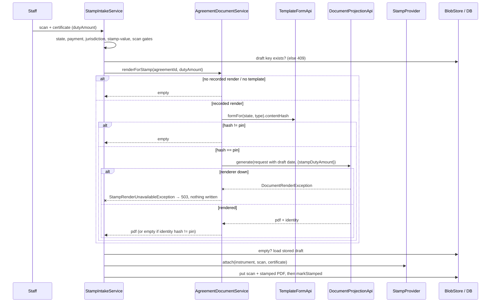

## Context

See proposal.md, "Why", for the bug and its root cause. The facts below shape the approach.

**Order of events** (since `state-stamp-duty-quoting`):

1. Draft generate (`POST /api/agreements/{id}/document`): `renderForDraft`, then
   `DraftService.attachDraft`, then `pinEffectiveTemplate`.
2. Stamp quote step (the legal duty is computed; the customer chooses a stamp value).
3. Finalise: the signing request is created in `PDF_GENERATED` and the draft is frozen.
4. Payment, with the quote frozen in `stamp_quote`.
5. Staff stamp intake (`StampIntakeService.attach`).
6. `STAMPED`, then signing.

The certificate's duty amount exists only from step 5, after the draft is frozen. The frozen quote is
what was **paid for**; the certificate can legitimately be higher.

**Intake.** Intake runs these gates, in order: stamp state, payment, jurisdiction, stamp value ≥ paid
value, scan validation. It then loads the stored draft and calls `StampProvider.attach`, which
prepends the scan. Blobs are written first, then the DB (`markStamped`, where the single-use
certificate index fires). A `StampFailedException` makes the request `STAMP_FAILED` and closes the
agreement as abandoned.

**Render inputs.** `AgreementDocumentService.render` builds its input from:

- the capture data, with the fixed columns overlaid;
- `capture.activeSections`;
- the template dimensions;
- the tracking reference.

The execution date is the captured `agreementDate`, or `LocalDate.now(clock)` when that is blank. The
resolved date is bound for the whole document (the header and the Term row).

**Pins and uploads.** The pin (`template_content_hash` + `template_layer_versions`) is set only on the
generate path. An upload (`POST /{id}/draft`) replaces the draft key but does **not** clear the pin. A
non-null pin therefore does not prove that the stored draft is a render.

**Request binding.** `DocumentProjectionRequest` is bound directly from the anonymous preview
endpoint's JSON body, so anything added to that record is client-settable.

## Goals / Non-Goals

**Goals:**

- The stamped instrument states the certificate's duty amount wherever the template asks for it.
- No draft or stamped instrument prints `[ Stamp duty paid (INR) ]`.
- The customer, or any HTTP client, cannot put a duty figure into a deed.
- No paid order is ever abandoned, and no bought certificate is ever burned, because of this change.

**Non-Goals:**

- Retroactively re-stamping agreements already `STAMPED` or later (including `AMPSFTXU5KV`).
- Changing how an optional *user-sourced* blank field renders in generate mode.
- Money reconciliation between the certificate and the paid-for value
  (`stamp-certificate-price-reconciliation`).
- Clearing the stale pin left by upload-after-generate. This change only stops trusting it (D4).
- Reconciling `document-stamping`'s outdated header requirement with the code.

## Decisions

### D1: Re-render at intake with the certificate amount

Intake asks `AgreementDocumentService.renderForStamp(agreementId, certificate.dutyAmount)` for the
instrument. When that returns bytes, those bytes go to `StampProvider.attach`; when it returns empty,
the stored draft does.

**Alternatives considered:**

- **Draw the amount onto the PDF with PDFBox.** Rejected: it cannot place text inside the statutory
  table or fill the gated clause. The composer was also deliberately stripped of printed certificate
  facts.
- **Render the frozen quote's stamp value at checkout.** Rejected on two counts. The draft is
  rendered before the quote, and is frozen at finalise. And the quote is what was paid for, not the
  certificate that was bought.
- **Remove the amount from the deed entirely.** Rejected as the primary fix: the statutory section and
  its clause exist to state the amount. In the fallback case the deed keeps the draft's provision row.

### D2: `source: system`, with the values on a Java-only method

- `Field` gains `FieldSource source` (`SYSTEM`, or `null` for user-sourced). It is bound from YAML
  `source:` (schema enum `["system"]`).
- It is serialized with `@JsonInclude(NON_NULL)`, so a user field's canonical JSON is byte-identical
  to before. Every template without a system field kept its content hash, and every existing pin
  stays valid.
- `overrideField` cannot change it: a source change is a remove plus an add.
- Load-time validation rejects `source: system` together with `required: true`.

`DocumentProjectionApi` gains `generate(request, systemValues)`, and `generate(request)` delegates to it
with no values. On every projection (preview included), `DocumentProjectionService.withSystemValues`
removes system-sourced keys from the submitted data, then adds the supplied system values for
system-sourced keys only. Validation and coercion then run as usual.

**Alternative rejected: a `systemValues` component on `DocumentProjectionRequest`** (the first draft
of this design). That record is the preview endpoint's `@RequestBody`, so any anonymous client could
have supplied a duty amount. A separate method cannot be reached over HTTP.

### D3: An unset system field shows its provision, or nothing

A field may declare `placeholder` text (schema: a non-empty string). It is included in the canonical
form only when set.

- A blank field of **any** source renders `[ placeholder ]` when declared, else `[ label ]`
  (unchanged).
- An unset **system-sourced** field that declares a placeholder keeps its row. In Telangana that is
  `Stamp duty paid (INR) [ Provision for stamp duty ]`, which is what the product owner asked the
  pre-payment draft to show.
- An unset system-sourced field with **no** placeholder is omitted: the customer was never asked for
  it, so a bare `[ label ]` would read as something they forgot to fill.
- `appendKeyValueBody` opens its table lazily, so an omitted run leaves no empty `<table>`.
- Clause slots keep the placeholder, so clauses that slot a system field must be `showWhen`-gated on
  it. A unit test enforces this over every production layer set. `tgStampAmount` is therefore absent
  from the draft and present in the stamped deed.

**Why the provision, not the paid-for stamp value, in the draft.** The draft is emailed when contacts
are confirmed, before the customer chooses a stamp value, and it is frozen at finalise. The owner
chose one draft reviewed before payment over a second post-payment copy. A post-payment email and an
in-app download stating the frozen quote's value were built and then withdrawn at the owner's
direction (2026-09-17).

### D4: Record the draft's printed execution date

`V21__draft_execution_date.sql` adds nullable `agreement.draft_execution_date DATE`.

- **Set:** on the generate path, together with the pin. `DocumentProjectionResult.executionDate`
  carries the resolved ISO date, and `AgreementController` passes it to
  `pinEffectiveTemplate(id, identity, executionDate)`.
- **Cleared:** by `Agreement.attachDraft`, so every store clears it (the generate path re-sets it in its
  pin step, and an upload leaves it `NULL`). Also cleared by `clearDraftPin`.

A non-null value therefore means exactly one thing: "the stored draft is a render, and it printed this
date".

`renderForStamp` re-renders only when all of these hold:

- the date is recorded;
- the pin is recorded;
- a template is selected;
- `TemplateFormApi.formFor(state, type).contentHash` equals the pin.

When the capture has no `agreementDate`, it passes the recorded date as `agreementDate`, so the intake
date is never printed. The rendered identity is checked against the pin again, in case the layers were
reloaded mid-call.

**Alternative rejected:** writing the resolved date back into `capture_state.data.agreementDate` at
generate time. That silently changes customer-owned data, which would then surface in the edit form.

### D5: Drift falls back; it does not refuse

This change bumps both `state:TG` layers, so every agreement drafted before deploy fails the hash
check. Refusing would block paid orders across every template deploy. Falling back keeps today's
behaviour, and the certificate page still evidences the duty.

Each fallback is logged at `INFO` with the agreement id and one of these reason codes:

- `NOT_A_RECORDED_RENDER`
- `NO_TEMPLATE`
- `PIN_DRIFT`

### D6: Renderer outage is `503`, never `STAMP_FAILED`

- The re-render runs after every gate and the draft-exists check, and before `attach` and any write.
- `renderForStamp` translates `DocumentRenderException` into the root-package
  `StampRenderUnavailableException`.
- `GlobalExceptionHandler` maps that to `503` with the problem type
  `urn:agreementmitra:problem:stamp-render-unavailable` and a constant detail.
- Intake audits it as `REJECTED_RENDER_UNAVAILABLE`.

Nothing has been written and the certificate index is untouched, so a retry with the same certificate
succeeds.

`DocumentRenderException` is **not** mapped globally: that would change the status of preview and
generate failures, which is outside this change.

Intake latency grows by one Gotenberg render, bounded by the existing render timeout. No DB
transaction spans it.

### D7: Template edits

- `rental/state-TG.patch.yaml`: v2 → v3.
- `commercial/state-TG.patch.yaml`: v1 → v2.

In both files, `stampDutyAmount` gains `source: system`, `placeholder: "Provision for stamp duty"` and a
dated comment. The rental file's comment
claiming "no empty amount ever renders" is rewritten to say why that is now true. Section order and
entries are unchanged.

## Risks / Trade-offs

- **[Risk]** The re-render differs from the draft in something other than the stamp content.
  → **Mitigation:** the same capture data, sections, reference and date are used, and the pin must
  match. The terms are frozen at finalise, before intake. The integration test asserts the stored
  draft is untouched and that the draft's execution date is kept.
- **[Risk]** Parties received the pre-stamp draft by email, and what they eSign carries one extra line
  and row. → **Mitigation:** the difference is the duty evidenced by the certificate bound as page 1
  of the same file. It is recorded in `COUNSEL-BRIEF.md`.
- **[Trade-off]** Pre-deploy Telangana agreements take the fallback, so their deed states no in-body
  amount. Their re-generated drafts at least stop showing the placeholder row. We accept this;
  sandbox rows only.
- **[Risk]** A future layer slots a system field in an ungated clause. → **Mitigation:**
  `SystemSourcedFieldTest.everyClauseSlottingASystemFieldIsGatedOnIt`.
- **[Risk]** A future preview/generate caller forgets that system values exist only on the Java
  overload. → **Mitigation:** submitted values are stripped on every path, so forgetting yields the
  provision row, never a client-supplied figure.

## Migration Plan

1. Deploy `V21` (nullable column, no backfill) together with the code. `ddl-auto: validate` is
   unchanged.
2. Agreements drafted after deploy take the re-render path. Earlier ones fall back (D5).
3. **Rollback:** revert the code. The nullable column is harmless to older code, and stamped PDFs
   already produced stay valid.
