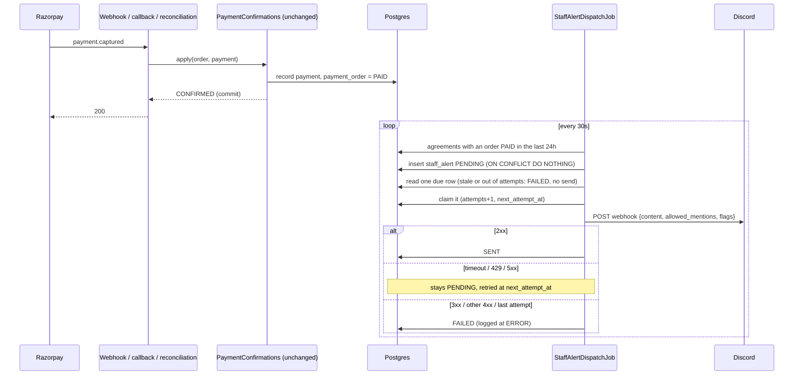

## Context

- A gateway payment is confirmed in exactly one place, `PaymentConfirmations.apply`, reached by
  the Razorpay webhook, the browser callback and `PaymentReconciliationJob`. It marks the
  `payment_order` row `PAID` with `confirmed_at`. Only the gateway path writes that status; a
  manual staff confirm or waive creates no payment order.
- `PaymentOrderService.applyConfirmation` maps **every** `DataIntegrityViolationException` from
  `apply` to `DUPLICATE_REFERENCE`, after which the webhook is acknowledged and the gateway does not
  redeliver. Anything added to that transaction that can raise one can silently undo a real
  payment.
- `PaymentConfirmedEvent` is documented as an after-commit event. Its one listener
  (`RecoveryOnPaymentListener`) runs synchronously on the producer's thread and swallows failures.
  There is no `@Async`, no outbox and no event publication registry.
- Outbound retry in this codebase is a database row plus a scheduled sweep
  (`SignedDocumentDeliveryService` + `DeliveryRetryJob`). There is no retry library and no `Clock`
  bean; delivery tests zero the backoff in the test profile.
- Vendor HTTP clients are `RestClient` over `JdkClientHttpRequestFactory`. The signing-module
  clients pin HTTP/1.1 and set no timeouts; `GoogleHttp` (identity module, not reusable here) sets
  3s connect / 7s read.
- The agreement UUID is a bearer credential. `AgreementIdSourceScanTest` scans main code and
  requires any logged `agreementId` to pass through `AgreementIds.redact`.
- `PaymentOrderQuery` is an existing public, read-only seam at the `signing` module root, adapted
  in `signing.payment`.
- Decided with the product owner: trigger is **gateway-paid only**; launch channel is **Discord**;
  WhatsApp follows once the Meta Cloud API setup exists; one alert per agreement.

## Goals / Non-Goals

**Goals:**

- A staff member is told within about a minute that a paid order is waiting.
- A confirmed payment never loses its alert to a crash, and the alert can never affect a payment.
- Nothing personal and no credential reaches the third-party channel.
- Adding WhatsApp later means one new adapter and its config.

**Non-Goals:**

- WhatsApp alerts, WhatsApp order intake, and alerts for placed / staff-confirmed / waived orders.
- A second alert for a second payment on one agreement (register row `double-charge-invisible-to-staff`).
- Changing the payment confirmation path in any way, including its catch-all integrity mapping
  (register row `payment-confirmation-catch-all-integrity-mapping`).
- Routing security events to the channel (`security-event-alerting`).
- A staff-console view of alert history, and console auto-refresh.
- Two channels at once. `staff_alert` holds one delivery state per agreement; WhatsApp **replaces**
  Discord behind the seam. Running both would need a schema change.
- A general notification framework. The customer-facing `ChannelDispatcher` stays separate.

## Decisions

### D1. Derive alerts from paid payment orders, in the sweep

Each sweep first asks `PaymentOrderQuery` for the agreements with a payment order that is `PAID`
and whose `confirmed_at` falls inside the last 24 hours, and inserts a `PENDING` `staff_alert` row
for each one that has none.

- **Why:** the paid order is already the durable record of the trigger. Reading it needs no
  listener, no write inside the confirmation transaction and no change to payment code, so the alert
  cannot roll a payment back or change when its constraints are checked.
- **Alternative — record the alert inside the confirmation transaction** (round-1 design):
  rejected. A native insert there forces a Hibernate flush, and any integrity error from the new
  table would be reported as `DUPLICATE_REFERENCE`, rolling back a captured payment with the
  webhook acknowledged.
- **Alternative — after-commit listener that inserts the row or posts directly:** rejected. A
  crash between commit and insert loses the alert; a direct post puts a third-party call on the
  webhook thread.
- **The 24-hour look-back** bounds the query and means enabling the feature alerts only on the
  last day of paid orders. A sweep outage longer than 24 hours loses alerts for orders paid before
  the window; the staff console queue still lists them.
- **`confirmed_at` is our own confirmation time**, set to `Instant.now()` in
  `PaymentConfirmations.apply`, not the gateway's capture time. A payment reconciled late still
  falls inside the window, which is what makes the look-back correct.
- There is no watermark: each sweep re-reads the whole window, so commit lag cannot skip an order.
- `PaymentConfirmedEvent` and its after-commit contract are untouched.

### D2. One alert per agreement

`staff_alert.agreement_id` is the primary key. The enqueue step is one native statement per
agreement with every column supplied from Java:
`INSERT INTO staff_alert (agreement_id, status, attempts, next_attempt_at, created_at) VALUES (…) ON CONFLICT (agreement_id) DO NOTHING`.

- `status` is the SQL literal `'PENDING'`, not a bound enum: Hibernate does not bind a Java enum to
  a native parameter as its name, and the value would fail the CHECK in D9.
- **The enqueue transaction is insert-only.** The `PaymentOrderQuery` read happens before it and
  outside it. The insert takes a key-share lock on the `agreement` row through the foreign key,
  which briefly conflicts with `recordPayment`'s row lock; keeping the transaction to the inserts
  alone keeps that window negligible.
- A failure there fails that sweep only.
- This is the first `ON CONFLICT` in the codebase. The existing idiom is insert-then-catch in a
  separate transaction; the upsert is one statement and needs no catch.
- A terminal row keeps the primary key, so an expired or failed alert is never re-enqueued.
- **Accepted consequences of the per-agreement key:**
  - A second paid order for an already-alerted agreement raises no alert. That is a double charge
    staff are not told about. Existing gap, recorded as `double-charge-invisible-to-staff`.
  - A gateway payment after a manual staff confirmation raises an alert. Correct: money arrived
    twice and one payment needs refunding.

### D3. Dispatch only from a scheduled job

`StaffAlertDispatchJob` runs every 30 seconds and calls `StaffAlertDispatcher.dispatchDue()`.

- A worst-case 30-second delay is immaterial against a stamp purchase that takes a person minutes.
- The scheduler pool grows 4 → 5 (`application.yml`), per the comment there. The stale
  `SchedulingConfig` javadoc, which names one job, is corrected.
- The dispatcher has three package-private steps, each taking the time as a parameter:
  `enqueue(Instant now)`, `dueAgreementIds(Instant now)` and
  `dispatchOne(UUID agreementId, Instant now)`. `dispatchDue()` composes them and reads
  `Instant.now()` afresh for each row.
- Tests call the steps with an explicit `now` and advance it, instead of zeroing the backoff, which
  would also zero the lease in D4. They can enqueue without sending, and dispatch one row without
  touching rows other tests left in the shared database.

### D4. Claim per row, send outside a transaction, record the outcome

One sweep, in order:

1. **Enqueue** (D1, D2).
2. **Select due rows:** `PENDING` with `next_attempt_at <= :now`, ordered by `next_attempt_at` then
   `agreement_id`, limited to the batch size.
3. **`dispatchOne` for each, one at a time:**
   - **Read** the row: `seen = attempts`, and `created_at`.
   - **Expire instead of sending** when `created_at` is more than 24 hours old or `seen` is already
     at the maximum: a conditional update to `FAILED`, one ERROR line, no send.
   - **Claim** by conditional update — `status = 'PENDING' AND attempts = :seen AND next_attempt_at <= :now`
     → `attempts = :seen + 1`, `next_attempt_at = :next`, where `:next = now + backoff(seen + 1)` is
     computed in Java. Zero rows updated means another run holds it; skip. The backoff rule lives
     in one place, `StaffAlertBackoff`, and never in SQL.
   - **Send** with no transaction open.
   - **Record**, guarded by `status = 'PENDING' AND attempts = :seen + 1`: `SENT` with `sent_at`; or
     `FAILED` on a permanent refusal or when the claimed attempt was the last; or nothing on a
     transient failure, since the claim already scheduled the retry.

- **Transactions.** `StaffAlertDispatcher` is never transactional. Each database step is one short
  transaction on a separate `StaffAlertPersistence` bean, as `DeliveryPersistence` does for
  delivery; a `@Transactional` helper on the dispatcher itself would be defeated by self-invocation.
  `AgreementService.staffViewsByAgreementId` opens its own read-only transaction.
- **Queries.** The conditional updates are JPQL `@Modifying` queries; only the enqueue insert is
  native. The repository extends `Repository<StaffAlert, UUID>`, not `JpaRepository`: with an
  assigned id and no `@Version`, an inherited `save()` would merge over the conditional-update
  state.
- **This deliberately differs from `SignedDocumentDeliveryService`**, which claims
  `PENDING → IN_PROGRESS` and writes backoff after a failure. That shape has no lease: a crash
  between claim and outcome strands the row in `IN_PROGRESS`. Writing the backoff at claim time
  makes it the lease, so a crash needs no recovery step below the attempt bound, and the expiry
  branch covers a crash on the last attempt. No shared abstraction is extracted.
- **Rows are claimed immediately before their own send**, with a fresh `Instant.now()` per row,
  never as a batch. A lease measured from the start of a slow sweep would already have lapsed for
  the later rows.
- **Lease invariant:** the shortest backoff (30s) exceeds connect + read timeout (10s). Both are
  code constants, not properties, so configuration cannot break it.
- **The 24-hour expiry is the rollback guard, not a retry bound.** Attempts run out in about three
  hours, so it fires only after the feature was switched off or the sweep was down. It counts from
  `created_at`.
- **No `@Version`.** Every mutation is a conditional update; optimistic locking would add nothing.
- **Trade-off — duplicates.** Two paths resend an alert Discord already accepted: a read timeout
  after acceptance, which is classed transient, and a crash before the record step. At-least-once
  is the right side to err on for an alert.

### D5. Failure classification and bounds

| Outcome | Class |
|---|---|
| 2xx | sent |
| timeout, connection error, 429, 5xx, any unexpected error while composing or sending | transient — retry |
| 3xx, any other 4xx (401, 403, 404), agreement no longer resolvable | permanent — `FAILED` now |

- Constants: `initial-backoff` 30s, doubling, `max-backoff` 1h, `max-attempts` 10, batch 20 rows per
  sweep. The waits are 30s, 1m, 2m, 4m, 8m, 16m, 32m, 1h, 1h: about three hours in total.
- Redirects are never followed (`HttpClient.Redirect.NEVER`); a 3xx would otherwise read as success.
- Discord's `Retry-After` on a 429 is not read. The minimum backoff already exceeds it at one
  message per order.
- A `FAILED` row logs at ERROR. There is no other surface for it; the staff console queue stays
  the source of truth for what is waiting. Accepted for launch.
- **`FAILED` is terminal.** A deleted or mistyped webhook fails each alert on its first attempt
  and nothing re-sends it. Recovery is a documented one-line SQL reset of `FAILED` rows to
  `PENDING`, and webhook rotation is ordered so the old URL stays valid until the new one is live
  (`docs/DEPLOYMENT.md`).

### D6. `StaffNotifier` seam

```java
interface StaffNotifier {
  boolean configured();
  void send(StaffAlertMessage message);   // throws StaffAlertDeliveryException(transient | permanent)
}
record StaffAlertMessage(String trackingReference, String stateCode, URI siteLink) {}
```

- `DiscordStaffNotifier` is the only implementation. It renders the text; the message record holds
  fields, so a WhatsApp adapter can map them to template parameters.
- **Enabled means `notifier.configured()`.** The dispatcher does not read Discord's configuration,
  so a replacement adapter changes nothing in recording or dispatch.
- `StaffAlertDeliveryException` carries a kind and an HTTP status. **It never carries a cause.**
- Package-private, inside `signing.staffalert`. No registry, no per-channel state.

### D7. Message content

- The fields come from `AgreementService.staffViewsByAgreementId(List.of(agreementId))` — the only
  lookup that resolves the template state. `StaffAgreementView` also carries party names, a city and
  the agreement UUID, so it is mapped to `StaffAlertMessage` **in one place, immediately**
  (`StaffAlertMessages.from`), and nothing else in the package touches the view.
- An agreement absent from the returned map is a permanent failure.
- **State:** the template state is a free string in template metadata (`IN`, `TG`, `KA` today). It
  is rendered only when it matches `^[A-Z]{2}$`; otherwise the message omits it.
- **No city.** City is user-entered.
- **Link:** `DeliveryChannelProperties.publicBaseUrl()`, trimmed. It is included only when it parses
  as an absolute `https` URI; the local default `http://localhost:5173` is omitted. The SPA has no
  router; a signed-in staff member lands on the console from the site root.
- **Discord body:** `content`, `allowed_mentions: {"parse": []}` and `flags: 4` (suppress embeds).

### D8. Configuration and the secret

- **Properties** (`staff-alert.*`): `discord.webhook-url` ← `STAFF_ALERT_DISCORD_WEBHOOK_URL`
  (default blank), `dispatch-enabled` (default true), `interval` (PT30S), `initial-delay` (PT1M).
  Nothing else is tunable.
- **Wiring:**
  - `@EnableConfigurationProperties(StaffAlertProperties.class)` sits on the dispatcher, which is
    unconditional. On the job it would vanish with `dispatch-enabled=false` in the test profile.
  - The job is `@ConditionalOnProperty(prefix = "staff-alert", name = "dispatch-enabled", havingValue = "true", matchIfMissing = true)`.
  - "Blank means disabled" is an in-method check on `configured()`. `@ConditionalOnProperty` cannot
    express it: an empty value is present and matches.
  - `DiscordStaffNotifier` constructs with a blank URL, as every test context and every boot before
    provisioning has one.
- **Blank or unusable means off.** The sweep returns before enqueuing, so nothing queues while
  disabled.
- **Usable** means: parses as a URI, is absolute, has a host, and its scheme is `https` — or `http`
  with a loopback host, which is what a local WireMock needs and never sends the token off the
  machine. Anything else (a scheme-less value, `http` to a remote host) leaves the notifier
  unconfigured with one ERROR that omits the value. Without this, a relative value would parse,
  fail every send as transient and burn every alert's attempts.
- **Handling the URL:**
  - It is bound as a `String`, with no Bean Validation: a bind failure would print the value.
  - The `URI` is built and checked once at construction inside a try/catch that discards the
    exception.
  - The request uses `.uri(URI)`, never a `String` template.
  - **The token-bearing exception stops at the adapter.** Spring's I/O-error message embeds the
    request URL, and the token is in the path. `DiscordStaffNotifier.send` catches
    `RestClientException` and any `RuntimeException` itself and rethrows only
    `StaffAlertDeliveryException(kind, status)`. It reads the status without installing a custom
    `ResponseErrorHandler`, which would add the URL to error-status messages too.
  - The client is built from the static `RestClient.builder()`, not the injected builder, so no
    observation registry is attached and the URL cannot reach a future tracing handler.
  - The adapter and the job log the exception class and HTTP status only — never the exception, its
    message or a cause.
  - `StaffAlertProperties` and its nested `discord` holder both mask the URL in `toString()`. The
    `StaffAlert` entity has a redacting `toString()`, like `StaffAgreementView`.
- **Host allowlist stays in the deploy template.** Tag:
  `#@ secret vendor optional pattern=^https://discord\.com/api/webhooks/[0-9]+/[A-Za-z0-9_-]+$`.
  `deploy.sh` checks the server's file against it on every deploy; a blank is exempt from the
  pattern. An in-app host check was considered and declined: the value is operator-set, the response
  is never reflected, and a test-only bypass flag would be a second way to turn the check off.
- **HTTP client:** `JdkClientHttpRequestFactory` over an `HttpClient` with HTTP/1.1, a 3s connect
  timeout, a 7s read timeout and redirects off. Timeouts are constructor parameters so tests can use
  sub-second values.
- The test profile sets `staff-alert.dispatch-enabled=false`; tests call the dispatcher directly.

### D9. Schema — `V27__staff_alert.sql`

| Column | Type | Notes |
|---|---|---|
| `agreement_id` | `UUID` PRIMARY KEY | `REFERENCES agreement (id)`, no `ON DELETE` clause, as in `V18` |
| `status` | `VARCHAR(24)` NOT NULL | `CHECK (status IN ('PENDING', 'SENT', 'FAILED'))`, as `V25` does |
| `attempts` | `INTEGER` NOT NULL DEFAULT 0 | |
| `next_attempt_at` | `TIMESTAMPTZ` NOT NULL | |
| `created_at` | `TIMESTAMPTZ` NOT NULL | |
| `sent_at` | `TIMESTAMPTZ` | |

- No surrogate id: one alert per agreement, so the agreement is the key.
- No `version` column (D4).
- Partial index on `next_attempt_at WHERE status = 'PENDING'`, following the `V25` precedent.
- The same migration adds a partial index on `payment_order (confirmed_at) WHERE status = 'PAID'`.
  The look-back query runs every 30 seconds, and the existing index is on `(status, created_at)`,
  so without it the query reads every paid order ever.
- The FK cannot block a delete: an agreement with any payment order is never hard-deleted
  (`Agreement.isDeletableDraft`).
- If `V27` is taken when this is applied, use the next free number.

### D10. `PaymentOrderQuery` gains one read

`List<UUID> agreementsWithOrderPaidSince(Instant cutoff)` — distinct agreement ids with a `PAID`
order whose `confirmed_at >= cutoff`, backed by a JPQL query on `PaymentOrderRepository`.

- It is the existing seam for "ask about payment orders without depending on `payment` internals".
- Read-only, and the only edit this change makes under `signing.payment`.

### Sequence



## Risks / Trade-offs

- **[Duplicate alert after a crash mid-send]** → accepted (D4). The message names the tracking
  reference, so a duplicate is recognisable.
- **[Webhook URL leaks through a log line]** → D8's rules. Tests capture every logger under
  `in.agreementmitra`, checking both messages and attached throwables, across error statuses, a
  timeout, a refused connection, an unusable URL and an unexpected error whose own message contains
  the URL, and assert the full URL and its token are absent.
- **[A `FAILED` alert goes unseen]** → ERROR log only. The console queue still lists the order.
  Raising failed alerts somewhere visible belongs with `security-event-alerting`.
- **[Orders that never pass through the gateway raise no alert]** → by decision. A manually
  confirmed or waived order reaches the queue silently; `PAYMENT_MODE` does not change this, since a
  gateway payment alerts in either mode.
- **[A leaked webhook URL lets anyone post fake "paid order" alerts]** → the alert is a prompt to
  open the console, never an instruction to act. Rotation (delete and recreate the webhook) is in
  `docs/DEPLOYMENT.md`.
- **[Staff do not get a phone notification]** → operational: the Discord channel must be set to
  notify on all messages on the staff member's phone. Written into `docs/DEPLOYMENT.md`.
- **[Tracking references accumulate in a third-party channel]** → a reference alone grants no
  access (`agreement-recovery`). Keep the channel private to staff; review membership when staff
  change.
- **[Suite wall-clock]** → one new Spring context; the adapter's timeout and classification tests
  run without Spring at sub-second timeouts. Report `check` duration against the 3-minute budget.

## Migration Plan

1. On the server, run `./provision.sh secrets` and leave the new key blank. A template key missing
   from the server's `backend.env` fails the deploy, so this comes first.
2. Deploy. `V27` applies; with the URL blank, behaviour is unchanged.
3. Create a private staff channel in Discord, add an incoming webhook, and set the URL through
   `./provision.sh secrets`.
4. Restart the backend. Orders paid in the previous 24 hours alert once. Make one test payment and
   confirm its alert arrives.

**Rollback:** blank the URL and restart. Pending alerts older than 24 hours are marked failed
rather than sent when the feature is switched back on. The table stays; forward-only migrations are
not undone.

## Open Questions

None blocking. The WhatsApp adapter's prerequisites (Cloud API registration of a number, an
approved utility template, whether the Business-app number can be shared) are recorded with its
follow-up register row.
