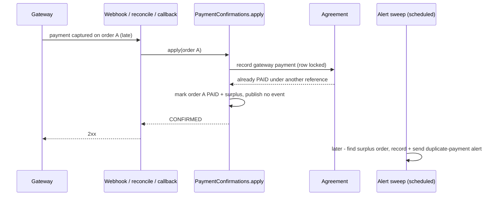

## Why

A customer can pay twice for one agreement and nobody on our side is told. A late gateway
confirmation for an expired or failed order still passes `PaymentConfirmations.apply` (only a
`PAID` order counts as settled), `Agreement.recordPayment` overwrites the first payment's record
without a guard, and the staff alert is one per agreement, so the second payment raises none. The
same happens when a gateway order is paid on an agreement staff already confirmed by hand. The
refund then starts with a complaint instead of with us. Real money, rare, and due before the first
paid release (register row `double-charge-invisible-to-staff`).

## What Changes

- **Keep the first payment's record.** A gateway confirmation for an agreement that is already
  `PAID` under a different payment reference still marks its order `PAID` (the money was captured)
  and marks that order **surplus**, but no longer overwrites the agreement's recorded amount,
  reference, actor or time.
- **No second "payment confirmed" effect.** A surplus payment does not publish
  `PaymentConfirmedEvent`, so the customer is not sent a second recovery link.
- **A distinct duplicate-payment staff alert.** The existing alert sweep also records one alert
  per surplus order and posts it to the staff channel, worded as a possible duplicate to check
  before refunding. A third payment raises its own alert. A surplus order raises this alert
  *instead of* the ordinary paid-order alert, never both.
- **One gateway payment id, one payment order.** A unique index stops a payment id being recorded
  on a second order, which the surplus path would otherwise no longer catch.
- **Unchanged on purpose:** a gateway payment on a `WAIVED` agreement records normally (one
  payment, not two); a gateway confirmation whose payment id equals the reference staff already
  recorded by hand is the same payment and is not surplus; the webhook acknowledgement and the
  reconciliation outcome are as today.

Out of scope:
- Stopping checkout from sending an already-paid customer to pay again (register row
  `checkout-ignores-agreement-paid-state`, parked Low by decision 2026-10-10).
- Any staff-queue flag, endpoint or frontend change.
- Issuing the refund, or any Terms of Service wording about duplicate payments.
- A manual staff confirmation recorded over an agreement the gateway already paid, and an
  agreement paid, waived, then paid again (both curl-only staff actions; known limits in design).
- Making stamp fulfilment and the payment-progress view read the credited order when it is not
  the newest one (pre-existing; appended to the same register row).

Signing-status FSM: **no transition touched.** Payment state (`UNPAID / PAID / WAIVED`) gains no
value; `PaymentOrderStatus` gains no value.

## Capabilities

### New Capabilities

None.

### Modified Capabilities

- `payment-processing`: adds the rule that a gateway payment on an already-paid agreement is kept
  as a surplus payment and leaves the agreement's first payment record untouched.
- `staff-order-alert`: adds the duplicate-payment alert; a surplus order raises it instead of the
  paid-order alert; the message may carry a fixed label naming the kind of alert; the
  "off the confirmation path" rule is reworded to "no alert record and no outbound call".

Relationship to `razorpay-payment` (active, unarchived): that change still holds the
gateway-confirmation requirements as `ADDED` deltas, so they cannot be modified from here. This
change adds its rule as a separate requirement that names itself the exception. Either may archive
first.

## Impact

- **Code:** `signing.payment` (`PaymentConfirmations`, `PaymentOrder`, `PaymentOrderRepository`,
  `PaymentOrderQueryAdapter`), `signing.agreement` (`Agreement`, `AgreementService` - one new
  method beside `recordPayment`), `signing` root (`PaymentOrderQuery`), `signing.staffalert`
  (entity, repository, persistence, dispatcher, messages, Discord adapter).
- **Schema:** `V28` - `payment_order.surplus`, a unique index on the order's gateway payment id,
  and `staff_alert` re-keyed so one agreement can hold more than one alert. Forward-only; `V27` is
  not edited.
- **Shared helper:** reference normalisation moves from `PaymentService` to
  `PaymentConfirmation` so the manual path and the new comparison use one copy.
- **APIs / frontend / env vars / dependencies:** none.
- **Webhook flow:** the confirmation path changes behaviour for one case only.

## PII / security review

- **Aadhaar / OTP / VID / KYC:** none involved.
- **New outbound PII flow:** none. The duplicate-payment alert carries the same three fields as
  the existing alert (tracking reference, two-letter state code, site link) plus a fixed label. No
  amount, no gateway payment id, no agreement id, no party detail.
- **Secrets:** none added; the staff channel address stays a secret read from configuration.
- **Logs:** new log lines use the existing redacted order fragment and redacted agreement id.
- **Webhook trust:** unchanged - signature verification and the authoritative read still precede
  `apply`.
- Sandbox and dummy data only is preserved.
