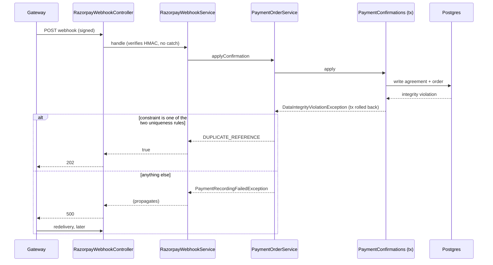

## Context

Every route that confirms a gateway payment - the webhook, the reconciliation job, and the
authoritative read behind the browser callback - ends in `PaymentConfirmations.apply`, one
transaction. Its caller, `PaymentOrderService.applyConfirmation`, catches
`DataIntegrityViolationException` outside that transaction and returns
`ConfirmationOutcome.DUPLICATE_REFERENCE`. The catch is by exception **type**, so it also covers
violations that are not duplicates.

Facts established against the code:

- Two constraints make a refusal a true duplicate: `uq_agreement_payment_reference` (V16, an
  expression index on `agreement`) and `uq_payment_order_provider_payment_id` (V28, on
  `payment_order`).
- Spring translates Hibernate's `DataException` (SQL state class 22, e.g. value too long) to
  `DataIntegrityViolationException` as well. `payment_order.provider_payment_id` is `VARCHAR(64)`
  and nothing validates the gateway's payment id length, so an over-long id is misreported as a
  duplicate today.
- `RazorpayWebhookService.handle` has no catch: a verified body is answered `202` unless something
  throws, and a runtime failure that is not an integrity error (lock timeout, lost connection,
  `ResourceNotFoundException`) already escapes as a non-2xx. Integrity errors are the one class the
  by-type catch converts into an acknowledgement.
- `GlobalExceptionHandler` has no handler for `DataIntegrityViolationException` and no fallback
  handler. An exception that escapes a controller becomes Spring Boot's default `500` and is logged
  by the container with its message and stack trace. The message of a
  `DataIntegrityViolationException` holds the SQL and the driver's error text.
- What keeps Postgres' DETAIL line (`Key (...)=(...)`, `Failing row contains (...)`) out of that
  text - and out of the line Hibernate's own `SqlExceptionHelper` logs at ERROR before any
  application catch runs - is `logServerErrorDetail=false` on the JDBC URL (`application.yml:21`,
  and `fixed` in `deploy/env/backend.env.example`). The integration harness builds its URL
  **without** that flag (`HarnessTestConfig`), so tests see the DETAIL line and production does not.
  Hibernate still logs the primary error (`value too long for type character varying(64)`), which
  holds no row data.
- The manual path can be refused for a non-duplicate reason today: `PaymentConfirmRequest.amount` is
  bounded only by `@DecimalMin`, and `agreement.payment_amount` is `NUMERIC(12,2)`, so an amount of
  10^10 or more overflows (SQL state 22003).
- `PaymentReconciliationJob.reconcile` already catches `RuntimeException` per order and logs a
  detail-free line.
- `PaymentService.confirm` (manual staff path) has the same by-type catch and maps it to
  `409 PAYMENT_REFERENCE_ALREADY_USED`. On that path only `uq_agreement_payment_reference` is a real
  duplicate; it never writes `payment_order`.
- No code in the backend reads a violated constraint's name yet. The Postgres driver is
  `runtimeOnly`, so main code cannot compile against `PSQLException`.

## Goals / Non-Goals

**Goals:**

- A duplicate is decided by **which constraint** refused the write, in one place.
- A non-duplicate integrity error is never acknowledged to the gateway.
- The failure that replaces the mislabel leaks nothing the old catch kept out of the log.
- Each of the two index names is pinned by a behaviour test, so a rename fails a test.

**Non-Goals:**

- No migration, no new payment state, no change to the signing FSM.
- No staff alert for a payment-recording failure (it is logged at ERROR; the alert is register row
  `payment-recording-failure-staff-alert`).
- No change to what a **true** duplicate does - including that reconciliation leaves such an order
  outstanding and re-reads it every sweep.
- No change to the other by-type catches (`PaymentOrderService.checkout` race,
  `DeliveryPersistence`, `StampIntakeService`): none of them acknowledges money.
- No input validation of the gateway payment id length or of the manual amount's size. Both are
  used as test provocations, and the fix is the classification, not a second rule about each input.
  Consequence, accepted: staff typing an absurd amount get `500` rather than `400` (they get a false
  `409` today). A payment id is stored at two widths (`VARCHAR(64)` on the order, `VARCHAR(128)` on
  the agreement); aligning them is a migration and is not part of this change.
- No change to the browser callback's behaviour for failures that are **not** payment-recording
  failures (a database outage still answers `500` there, as today).

## Decisions

### D1 - Classify by constraint name, in one package-private class

A new `PaymentIntegrity` (package `in.agreementmitra.signing.payment`, package-private, static
methods, no Spring bean) owns:

- the two names as constants, and
- `Optional<String> violatedConstraint(DataIntegrityViolationException)`, which walks the cause
  chain to `org.hibernate.exception.ConstraintViolationException` and returns
  `getConstraintName()`, lower-cased with `Locale.ROOT`;
- `String sqlState(...)`, the first `java.sql.SQLException` SQL state in the chain, or `null`.

Hibernate is already an `implementation` dependency, so this needs no new dependency and no
compile-time reference to the Postgres driver.

*Alternatives:* matching on the exception message text (brittle, and the message is what must not be
handled); a read-before-write duplicate check (the existing design rejects it - two concurrent
confirmations must not both win); `PSQLException.getServerErrorMessage().getConstraint()` (the
driver is `runtimeOnly`).

**The names exist in two places** - the migrations and this class - and cannot be merged, because
an applied migration is never edited. The mitigation is that each name is exercised by an
integration test against real Postgres (D6): rename an index and the matching test fails, instead of
duplicates silently becoming failures.

### D2 - Unrecognised means failure, never duplicate

A violation with no constraint name, or a name that is not one of the two, is a payment-recording
failure. If Hibernate ever stopped reporting the name, true duplicates would turn into failures: the
gateway would redeliver and the log would show ERRORs. That is noisy and visible. The opposite
default - unrecognised means duplicate - is the current defect.

### D3 - The failure is a new exception that carries no database text

`PaymentRecordingFailedException` (package-private, `RuntimeException`) is built from the constraint
name (or `unnamed`) and the SQL state only. It is constructed **without a cause**: the cause's
message is the SQL plus the failing-row detail, and a stack trace printed by the container would
print it.

`applyConfirmation` logs one ERROR line - redacted order id, the name the database reported, SQL
state - and throws it. No payment id, no amount. `PaymentService.confirm` logs the same shape with
the redacted agreement id. The reported name is whatever Hibernate extracts: a constraint or index
name for most violations, a column name for a not-null violation (23502), nothing for a data error.

This is defence in depth for the application's own log line and for the stack trace the container
prints. It does not, and cannot, govern `SqlExceptionHelper`; `logServerErrorDetail=false` (see
Context) is what governs that, and this change does not touch it.

When both writes in the transaction would be refused, only the first refusal is ever seen and
classified - the transaction is over by then.

*Alternative:* rethrow the original exception. Rejected: nothing between the controller and the
container log would redact it.

### D4 - The webhook lets it propagate

`RazorpayWebhookService.apply` does not catch `PaymentRecordingFailedException`, so the controller
never reaches `ResponseEntity.accepted()` and Spring Boot answers `500`. No handler is added to
`GlobalExceptionHandler`: the body carries no message because `application.yml:62-66` pins
`include-message: never`, `include-stacktrace: never` and `include-exception: false`, and a
dedicated mapping would add a second place that decides this status. The `500` is reachable only
after the HMAC verifies, so a caller without the webhook secret still only ever sees `401`.

### D5 - The browser callback catches it; reconciliation is untouched

`PaymentOrderService.acknowledgeCheckout` wraps its `readAuthoritatively` call in a catch for
`PaymentRecordingFailedException` and falls through to `progress(...)`. The callback is a UX signal:
the customer sees "payment pending" rather than an error page. The catch completes nothing - the
webhook redelivery and reconciliation meet the same refusal until its cause is fixed (see Risks). The
ERROR line from D3 has already been written, so the catch logs nothing more. Only
`PaymentRecordingFailedException` is caught - any other failure behaves as it does today.

`PaymentReconciliationJob` needs no code change: its per-order `catch (RuntimeException)` already
leaves the order `CREATED` and moves on.

### D6 - The manual path uses the same classifier

`PaymentService.confirm` answers `409` only when `PaymentIntegrity` names
`uq_agreement_payment_reference`. Otherwise it throws `PaymentRecordingFailedException`, which
becomes `500`. The order-payment-id constraint is not accepted here: this path never writes
`payment_order`, so seeing it would itself be unexpected.

### D7 - Tests provoke a real non-duplicate violation with an over-long payment id

A 65-character payment id through the signed webhook makes Postgres refuse the `payment_order`
write with SQL state 22001, which is a `DataIntegrityViolationException` with no constraint name.
This needs no test-only seam and no extra constraint. If the column is ever widened or the id is
validated earlier, these tests must pick another provocation; each asserts the refusal itself (the
failure, the `500`, or the ERROR line), so it fails loudly rather than passing over nothing. The id
fits `agreement.payment_reference`, so the order write is the only one refused. Which of the two
writes Hibernate sends first is not relied on; rollback after a successful first write is what the
cross-agreement duplicate test (2.6) exercises.

On the browser-callback route the 65-character id lives only in the stubbed provider response: the
callback body's own payment id is `@Size(max = 64)` and is used for the handler signature alone.
On the manual route the provocation is an amount of 10^10.

The unit level covers `PaymentIntegrity` with hand-built exception chains (named constraint, other
constraint, no Hibernate cause, mixed case), and `PaymentService` / `PaymentOrderService` with
mocked collaborators.

## Risks / Trade-offs

- [The gateway retries a non-2xx with exponential backoff for 24 hours after the event, and
  disables a webhook that keeps failing for 24 hours (gateway documentation, read 2026-10-10). The
  failures in scope today are permanent, so one left alone for a day can switch the webhook off]
  -> Decided 2026-10-10: keep the `500`. The disable is loud - the gateway emails the webhook's alert
  address - and undone with a dashboard toggle once the fix is deployed. While it is off, the
  browser callback still confirms a customer who stays on the page and reconciliation confirms
  outstanding orders every five minutes; only a late payment on an already expired or failed order
  is missed, and such an event can be replayed by a gateway support ticket for 15 days. The
  alternative - answer `202` and rely on reconciliation - was rejected because its failure is
  silent. The alert address being set and read is therefore a dependency (task 4.4).
- [A payment-recording failure in scope today is deterministic: retrying cannot fix it without a
  deploy or a human. The order never leaves `CREATED` (the throw precedes the expiry check), checkout
  resumes that order so the customer cannot start a fresh one, and the only signal is one ERROR line
  plus one WARN per order per five-minute sweep] -> Strictly better than today's silent `202`, and
  not a double charge. Telling staff is register row `payment-recording-failure-staff-alert`
  (decided 2026-10-10: its own change - it needs a new alert kind and a migration).
- [A failing order sits at the head of the oldest-first reconciliation batch] -> Same as a true
  duplicate today. It is **not** bounded: fifty such orders (the batch size) would starve newer
  orders of reconciliation. Not made worse per order by this change, but reconciliation is this
  design's fallback, so it is stated plainly.
- [Hibernate extracts the constraint name by matching the server's English message text, so it
  depends on the dialect and on the server's `lc_messages`] -> D2 makes the failure mode loud (true
  duplicates become `500`s), the two integration tests pin the Testcontainers image, and manual
  testing checks `SHOW lc_messages` on the production database.
- [Staff see `500` instead of `409` for a non-duplicate failure on the manual path] -> Intended: the
  old `409` told them the reference was reused when it was not.
- [The container logs the sanitised exception's stack trace as well as the ERROR line, and
  Hibernate logs the driver's primary error] -> Three lines for one failure. None carries the
  payment id, the amount or row content in the production configuration. Accepted over adding a
  handler.
- [The scenario "a payment id staff already recorded against another agreement" writes existing
  behaviour into the spec: money captured, `202`, second agreement unpaid, a WARN line] -> A true
  duplicate, so correct to refuse; that staff are not told is the same visibility gap as above.

## Migration Plan

Code-only; deploy as usual. Rollback is reverting the commit - no data shape changes either way.

## Open Questions

None. Whether a single failing event among many successful ones is enough for the gateway to
disable the webhook is not stated in its documentation; the decision above holds either way.
